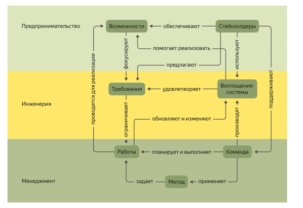
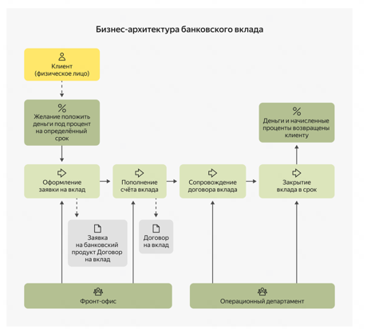
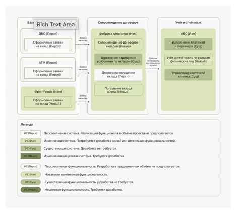

# ИТ-ландшафт и архитектурные принципы

ИТ-ландшафт современных компаний сложен и состоит из сотен или тысяч систем, тесно интегрированных с бизнес‑процессами. За архитектуру решений в компании отвечают от нескольких до десятков специалистов — в зависимости от масштаба бизнеса. Основная задача архитектора — спроектировать и запустить новый продукт с учётом существующего ИТ‑ландшафта. Первый этап работы архитектора — анализ текущего ИТ‑ландшафта и формулировка принципов для новых продуктов. Ключевой элемент ИТ‑ландшафта — портфель приложений, управляемый через Application Portfolio Management (APM). Информация об ИТ‑системах собирается в репозитариях; при их отсутствии данные извлекаются из косвенных источников. Для эффективного управления ИТ формулируются атрибуты описания систем: функциональность, связь с бизнес‑процессами, дорожная карта, роли, подключение к сервисам и т. д. Архитектурные принципы не универсальны — они отражают ценности и стратегию конкретной компании. Стандарты архитектуры не являются фиксированным набором правил, а воплощают корпоративные ценности в технологиях. Архитектор анализирует существующие продукты на соответствие принципам, выявляет нарушения и предлагает улучшения. Архитектурный контекст определяется текущим ИТ‑ландшафтом и принятыми в компании принципами и стандартами.

### Литература по теме

- **Материалы учебного курса Анатолия Левенчука «Системноинженерное мышление в управлении жизненным циклом»** — про анализ бизнеса и жизненный цикл технологий.
- **Статья «Кривая хайпа Гартнера: 30 лет измерения ожиданий»** — о том, как технологии часто проходят одни и те же этапы в своем жизненном цикле.
- **Книга экспертки в проектировании систем, облачных технологиях и DevOps Танусри Датта Маккейб «Fundamentals of Enterprise Architecture»** — о роли специалиста корпоративной архитектуры.

# Зрелость технологий и анализ бизнеса

- Технологический радар (техрадар) помогает учитывать используемые технологии и мониторить их жизненный цикл, разграничивая привлекательные и проблемные технологии для новых разработок.
- Техрадар группирует технологии по степени привлекательности: перспективные, приоритетные и нерекомендуемые, а в сложных вариантах — по типам и сценариям применения.
- Fit-gap анализ позволяет сопоставить бизнес‑функции нового продукта с существующими системами, чтобы сократить сроки разработки и упростить интеграцию.
- Специалист по архитектуре решений работает с бизнесом, а не с абстрактными системами, поэтому важно понимать ключевые бизнес‑процессы и критичные точки.
- Референсная модель — это стандартизированная структура для описания процессов и функций организации, помогающая анализировать деятельность, выявлять слабые места и оптимизировать процессы.
- В крупных компаниях процессы делятся на три уровня: основной бизнес, вспомогательные службы и управление организацией.
- Карты процессов упрощают поиск готовых решений, очерчивают функциональные границы и помогают быстро находить владельцев процессов и задействованные ИТ‑сервисы.
- Референсные модели задают общий язык для описания бизнеса и становятся инструментом анализа при связывании с реальным ИТ‑ландшафтом компании.
- Примеры референсных моделей: BIAN (банковский сектор), eTOM (телеком), модели для нефтегазового сектора и других отраслей.
- Референсные модели схожи по структуре, но имеют отраслевую специфику и полезны при проектировании компании, разграничении зон ответственности и выборе систем.

### Литература по теме

- **BIAN** — портал архитектурных моделей в банковской индустрии.

# Интервью с клиентом

Ключевая задача специалиста по архитектурным решениям на старте проекта — понять бизнес‑контекст и сформировать целостное представление о продукте. Основной инструмент для этого — интервью с клиентом, которое помогает определить смысл проекта, ожидания сторон и границы решения. Стандарт OMG Essence структурирует работу над интервью, выделяя три уровня: предпринимательство, инженерия и менеджмент. Проект рассматривается через ключевые «альфы»: возможности, требования, стейкхолдеры, работы, команда, метод и воплощение системы.
  
Интервью стоит начинать с контекста: почему возникла задача, какие есть ограничения и что будет, если продукт не появится. Требования часто бывают неполными и противоречивыми — это нужно выявлять и прорабатывать. Понимание стейкхолдеров, команды, процессов работы и выбранного метода помогает снизить организационные риски проекта. Отсутствие ответов на ключевые вопросы — сигнал о потенциальных рисках, которые важно зафиксировать и проработать. Технические решения и «воплощение системы» определяются после интервью и фиксируются в архитектурном видении.

### Литература по теме

- **Стандарт OMG Essence** — помогает отслеживать зрелость проекта через зрелость его значимых частей.
- **«Вопросы клиентам» от «Бюро Горбунова»** — пример того, как компания понимает, как может быть полезна и кто в бюро займётся проектом.

# Управление границами проекта

Стейкхолдеры — это заинтересованные стороны, которые помогают проекту добиться успеха. Задача стейкхолдеров — определить, кто и как будет решать сложные вопросы в проекте. Ключевые роли в проекте: спонсор, клиент, поддержка, поставщики инфраструктуры, контролёры информационной безопасности. Границы проекта — это чёткое определение того, что входит в проект, а что остаётся за его пределами. Без чётких границ возникает «раздувание содержания» (Scope Creep), что ведёт к задержкам и перерасходу ресурсов. Архитектурные границы проекта включают системы, интеграции и функциональность. Границы проекта фиксируются в архитектурном видении, техническом задании или уставе проекта. Необходимо заранее проговорить, как будут меняться границы проекта, включая регистрацию запросов на изменение и оценку их влияния. При выборе между разработкой и покупкой решения важно учитывать стратегические цели, стоимость, сроки, риски и ограничения. Покупка готового решения оправдана для типовых процессов, пилотных проектов, редкого использования и в случаях высокой сложности или рисков разработки. Внутренняя разработка предпочтительна при наличии уникальных бизнес‑процессов, необходимости независимости от вендора и стремлении к стратегическим преимуществам. Часто используется комбинированный подход: использование готовых платформ с кастомизацией или разделение пользовательского интерфейса и учётных систем. Ключевая задача специалиста архитектурных решений — выявить стейкхолдеров, зафиксировать границы проекта и определить стратегию реализации.

### Литература по теме

- **Статья «10 типов стейкхолдеров, которые вам встретятся в бизнесе»**. Из неё вы узнаете, что они бывают не только внутренними или внешними.
- **Статья «От задачи, а не от решения»**. Хотя автор утверждает, что умение думать от задачи, а не от решения — важный навык руководителя, на самом деле это полезно всем.

# Архитектурное видение

Архитектурное видение — документ из TOGAF, описывающий ключевые аспекты будущего продукта. TOGAF — стандарт управления ИТ‑архитектурой, структурирующий работу с ИТ‑проектами. Архитектурное видение служит «мостиком» между бизнес‑целями и технической реализацией. Документ помогает согласовать понимание контекста проекта у всех сторон. Руководитель проекта использует АВ для разделения работ на независимые части и контроля объёма проекта. Техническим командам АВ помогает понять свои роли и оценить требуемые ресурсы. АВ нужно актуализировать в течение всего проекта. Документ должен быть коротким и структурированным, чтобы заранее выявить пробелы и противоречия.

Содержание АВ включает:

- **Введение** — какую проблему решаем, область применения, глоссарий.
- **Бизнес‑контекст** — фиксируем цели, стейкхолдеров и стратегические драйверы.
- **Описание текущего и целевого состояния** — описываем ИТ‑инфраструктуру и болевые точки системы. Целевое состояние включает высокоуровневую диаграмму решения и описание ключевых компонентов.
- **Архитектурные принципы** — определяем основные направления (например, фокус на облачных решениях).
- **Нефункциональные требования** — охватываем производительность, масштабируемость, доступность и безопасность.
- **Дорожную карту** — описываем этапы перехода и анализ соответствия.
- **Риски и допущения** — фиксируем технические риски и базовые предположения архитектуры.

### Литература по теме

- **Описание архитектурного видения в стандарте TOGAF.**

# Бизнес-архитектура

На начальном этапе бизнес‑архитектуру описывают на одной схеме для согласования контекста между бизнесом и разработчиками. Схема должна быть простой и содержать только элементы, обеспечивающие связи между командами. Бизнес‑архитектура описывает процесс на высоком уровне, оставляя возможность для уточнения на следующих этапах. Основные шаги взаимодействия с продуктом включают оформление, пополнение, сопровождение и закрытие договора. Начало и конец процесса полезно маркировать бизнес‑событиями. Процессы лучше называть глаголом или отглагольным существительным с объектом, на который направлено действие. Элементы на схеме группируют по типам, связи оформляют горизонтально или вертикально, шаги процесса располагают слева направо и сверху вниз.
  
Простая диаграмма бизнес‑архитектуры помещается на один слайд и читается без изменения масштаба. Функциональные границы определяют состав функций для продукта — существующих и новых. Для каждого продукта или функциональной области бизнеса формируют отдельную схему с фокусом на важном. Функции в бизнес‑процессе должны иметь смысл для заказчика и быть привязаны к ответственному подразделению или роли. В бизнес‑процессе показывают функции времени эксплуатации, а не разработки и внесения изменений в системы. Проектирование процесса начинают с перечня ключевых взаимодействий пользователя с продуктом. Количество шагов процесса должно быть небольшим, а сам процесс — линейным.

### Литература по теме

- **Книга Буч Грэди и Роберта Максимчука «Объектно-ориентированный анализ и проектирование с примерами приложений».**
- **Книга Алистера Коберна «Современные методы описания функциональных требований к системам».**
- **Руководство, как использовать цвета в «Архимейте».**
- **Статья «Правила близости»**, которая объясняет, почему человеку проще разобраться, а схемы выглядят аккуратней, если объекты сгруппированы определённым образом.

# Концептуальная архитектура

Концептуальная модель данных (КМД) помогает эффективно распределить функции между системами. КМД фиксирует единый перечень бизнес-объектов и их общие наименования. КМД определяет зоны ответственности систем и помогает согласовать API со смежными командами. Если готовой КМД нет, её стоит начать создавать в рамках проекта, обозначив сущности крупными мазками. Функциональные границы систем помогают понять, какая система отвечает за каждый объект. Функциональность лучше развивать в существующих системах, а не создавать новые. Нужно использовать ограниченные контексты и минимизировать количество команд, вовлечённых в изменение функции. Следует избегать двусторонней синхронизации систем и цикличных интеграций. Концептуальная архитектура отображает состав систем, распределение ответственности и интеграционные потоки. Для проектирования концептуальной архитектуры используют нотации Archimate, C4, UML и BPMN. Компании обычно адаптируют подходы к проектированию под свою специфику. Концептуальная архитектура — ключевой артефакт в проектной работе, который нужно постоянно обсуждать и корректировать. Первую версию концептуальной архитектуры можно создать за несколько часов, финальная версия формируется ближе к завершению проекта.

  

### Литература по теме

- **Примеры лучших практик, как проектировать схемы в нотации Archimate.**

# Альтернативные варианты концептуальной архитектуры

Продукт развивается итерационно, поэтому может быть несколько архитектур, каждая решает свои задачи. Альтернативные варианты архитектуры нужны для сравнения подходов и обоснованного выбора направления развития продукта. Промежуточная архитектура позволяет быстрее дать результат бизнесу и упрощает переход к целевой архитектуре. Одни и те же функции можно реализовать разными способами, отличающимися по срокам, затратам и стоимости владения. Осознанный выбор архитектуры важен для стейкхолдеров, особенно в дорогостоящих проектах.

Fit/gap анализ — универсальный инструмент для сравнения альтернативных вариантов архитектуры. Для сравнения архитектур используют стратегические и проектные критерии, которые должны отражать стратегию компании и параметры проекта. Принятые архитектурные решения следует фиксировать в формате ADR (Architecture Decision Record). Дублирование функций в разных системах может привести к проблемам, его нужно выявлять и устранять. При доработке функций важно учитывать зависимости между системами и проектировать контракты взаимодействия.

Создание нового продукта требует оценки мощности серверов, пропускной способности каналов и устойчивости к отказам. Всегда стоит предлагать несколько вариантов архитектуры: минимально достаточный, оптимальный и целевой.

### Литература по теме

- **Книга Майкла Найгарда «Выпускаем в свет! Разработка и внедрение ПО, готового к выпуску»**. В ней, в частности, есть про стратегию грациозного отказа.
- **Примеры ADR.** https://adr.github.io
